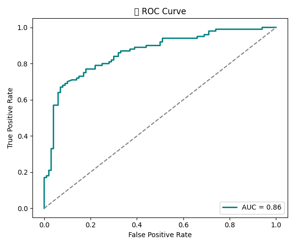

# AegisX-CPU-Crime-Detector
Real-time lightweight CPU-based video crime detection system using ONNX + SVM + Telegram alert

<p align="center">
  
</p>

<h1 align="center">🛡️ AegisX: CPU-based Real-time Crime Detection from CCTV Footage</h1>

<p align="center"><i>"Surveillance that watches with precision, responds with speed, and empowers with intelligence."</i></p>

---

## ✨ What is AegisX?

**AegisX** is a real-time, CPU-efficient crime detection system that uses MC3-based spatiotemporal features and an optimized SVM classifier to detect crime in CCTV-styled video footage.  
No GPUs. No YOLO. Just precision-packed surveillance tech that’s sleek, fast, and ready to deploy.

> ⚠️ This model performs best on **CCTV-styled surveillance footage** and **not on mobile phone–recorded or cinematic videos**.

---

## 🎯 Features

- ✅ Real-time video inference on CPU
- ✅ MC3-based spatiotemporal feature extraction (ONNX)
- ✅ SVM classifier trained with GridSearchCV (80%+ accuracy)
- ✅ Telegram alerts with screenshots if crime persists for >5 seconds
- ✅ Lightweight, fast & deployable
- ✅ Custom ROC, PR Curve, and Confusion Matrix visualizations

---

## 📊 Results (Visualizations)

<p align="center">
   
  <br>
   
   
</p>

---

## 📷 Telegram Bot Integration

<p align="center">
  
</p>

---

## 🎥 Demo Video


> 🔽 Full video: [Watch the demo (MP4)](lasthope/assets/crimedetected.mp4)

---

## 📂 Dataset Used

We used a subset of the **[UCF Crime Dataset](https://www.crcv.ucf.edu/data/UCF-Crime.php)** for both training and testing.  
To maintain efficiency, features were extracted and saved in `.npy` format.

> 📧 If you're interested in using my extracted UCF features, feel free to reach out to me: **aditwisingh@gmail.com**

---

## 🌍 About Me

Hi! I’m **Aditri Singh** — a passionate computer vision engineer with a focus on **surveillance, security, and defense systems**.

- 🎓 CSE (AI & ML) @ Parul University  
- 💻 Specializing in real-time visual AI  
- 🇳🇱 Actively looking for roles in The Netherlands 🇳🇱  
- 🧠 Obsessed with system optimization & camera intelligence  
- ✨ Let’s build safe, smart cities together.

---

## 🚀 How to Run AegisX (CPU)

```bash
# Step 1: Clone the repo
git clone https://github.com/aditrisingh/AegisX-CPU-Crime-Detector.git
cd AegisX-CPU-Crime-Detector

# Step 2: Create virtual environment
python -m venv last
source last/Scripts/activate  # On Windows

# Step 3: Install dependencies
pip install -r requirements.txt

# Step 4: Run detector
python cpu_crime_detector.py
